# Varunetra — Software-Defined Sonar Transmitter Payload

**वरुणनेत्र** *(Varuna — Vedic god of the ocean, + Netra — "eye")*
**"The eye of Varuna" — a real-time, environment-adaptive LFM sonar chirp transmitter for AUVs.**


  


[](https://www.st.com/en/microcontrollers-microprocessors/stm32f407ve.html)
[]()
[](LICENSE)

---

## Overview

Traditional sonar transmitters emit a fixed-frequency pulse — the waveform is baked in at design time, forcing a permanent trade-off between range (low frequency) and resolution (high frequency). Real underwater environments don't stay fixed: turbidity, depth, and target distance change constantly during a single AUV mission.

**Varunetra** is a physical, self-contained embedded transmitter that behaves like a Software-Defined Radio for sonar. It synthesizes a Linear Frequency Modulated (LFM) chirp entirely in real time on an STM32F407VE, and reshapes that waveform on the fly based on three environmental control inputs — with **zero CPU load during transmission**, since the DAC is streamed purely by DMA under hardware-timer control.

This repository contains the firmware, the analog reconstruction filter design, and a Python "digital twin" simulator used to validate the firmware's math independently of the hardware.

---

## Key Features

- **Real-time LFM chirp synthesis** via a phase-accumulator DDS algorithm running on the Cortex-M4F's hardware FPU
- **Zero-CPU-overhead transmission** — TIM6 (hardware timer) triggers DAC1 via DMA1 in Normal mode; the core is free for the entire burst
- **Live environmental adaptation** — 3 potentiometers (simulating sensor inputs) reshape the chirp instantly:
  - Sweep bandwidth (clarity/resolution)
  - Pulse duration (energy/range)
  - Amplitude (transmit power)
- **Hamming-windowed envelope** to suppress spectral sidelobes and protect the analog front-end from sharp edge transients
- **Active analog reconstruction filter** (Sallen-Key + unity-gain buffer) to convert the DAC's staircase output into a clean sine sweep
- **Python digital twin** — a matplotlib/scipy simulator that mirrors the firmware's exact math, used as ground truth for oscilloscope validation
- **UART debug telemetry** — live raw ADC + computed chirp parameter readout for verification without a logic analyzer

---

## Hardware Architecture

```mermaid
flowchart TD
    A["3 Potentiometers<br/>Nirmalya · Kaalavistar · Ojas"] --> B["ADC1<br/>PA1 / PA2 / PA3"]
    B --> C["sensors_read&#40;&#41;<br/>raw counts to f0, f1, duration, amplitude"]
    C --> D["chirp_gen_compute_var&#40;&#41;<br/>Phase-accumulator DDS + Hamming window"]
    D --> E["DMA1 Stream5 Ch7<br/>Normal mode, buffer to DAC1_DHR12R1"]
    F["TIM6 to TRGO<br/>Update Event, fs approx 1.2537 MSPS"] -->|triggers| E
    E --> G["DAC1_CH1 to PA4<br/>12-bit staircase output"]
    G --> H["Sallen-Key LPF<br/>CA3140 #1, fc approx 590 kHz"]
    H --> I["Unity-gain buffer<br/>CA3140 #2"]
    I --> J["Clean sine LFM sweep<br/>to transducer / oscilloscope"]

    style A fill:#e8f4fd,stroke:#2b7cb3
    style B fill:#e8f4fd,stroke:#2b7cb3
    style C fill:#eafaf1,stroke:#27ae60
    style D fill:#eafaf1,stroke:#27ae60
    style E fill:#fff3e0,stroke:#e67e22
    style F fill:#fff3e0,stroke:#e67e22
    style G fill:#fdecea,stroke:#c0392b
    style H fill:#f4ecf7,stroke:#8e44ad
    style I fill:#f4ecf7,stroke:#8e44ad
    style J fill:#eafaf1,stroke:#27ae60
```



### Hardware Components

| Component | Part / Value |
|---|---|
| MCU | STM32F407VE (DevEBox), Cortex-M4F, Hard-FPU |
| DAC output | DAC1_CH1 → PA4, 12-bit right-aligned |
| Trigger timer | TIM6, PSC=0, ARR=66 → fs ≈ 1,253,731 Hz |
| DMA | DMA1 Stream5 Ch7, Normal mode, half-word |
| Sensor ADC | ADC1, channels 1/2/3 → PA1/PA2/PA3 |
| Debug UART | USART1, PA9(TX)/PA10(RX), 115200 baud |
| Trigger button | PE4 (active-low) |
| Scope sync pin | PB0 (high during active burst) |
| Filter op-amps | 2× CA3140 |

---

## Potentiometer / Environmental Sensor Mapping

| Knob | Pin | Controls | Range | Simulates |
|---|---|---|---|---|
| **Nirmalya** *(clarity)* | PA1 (ADC1_IN1) | Sweep bandwidth (f0 fixed @ 100 kHz, f1 scales) | f1: 150 kHz – 500 kHz | Water turbidity — clearer water enables a wider, higher-resolution sweep |
| **Kaalavistar** *(duration)* | PA2 (ADC1_IN2) | Pulse duration | 0.5 ms – 5 ms | Target distance / required acoustic energy |
| **Ojas** *(power)* | PA3 (ADC1_IN3) | Amplitude scale | 10% – 100% | Water depth / attenuation compensation |

---

## Analog Reconstruction Filter

The STM32's DAC output is a zero-order-hold staircase — each sample holds its voltage until the next one, which is audible/visible as steps rather than a smooth sine. A 2-stage active filter cleans this into a proper analog sine sweep.

**Stage 1 — Sallen-Key low-pass (unity gain, CA3140 #1)**

| Component | Value |
|---|---|
| R1 = R2 | 2.7 kΩ |
| C1 = C2 (filter caps) | 100 pF |
| Cutoff frequency | ≈ 590 kHz |

**Stage 2 — Unity-gain output buffer (CA3140 #2)**
Isolates the filter from downstream load (transducer/amplifier/scope probe) so the load doesn't drag down the tuned cutoff.

**Power:** both op-amps run off a shared 5V single supply from the STM32 board, with a 100nF decoupling capacitor at each IC's supply pin.

<!--
  Add filter schematic photo/render here:
  
-->

---

## Repository Structure

```
.
├── Core/
│   ├── Inc/
│   │   ├── chirp_gen.h        # LFM generator public interface
│   │   └── sensors.h          # Potentiometer reading interface
│   └── Src/
│       ├── chirp_gen.c        # Phase-accumulator DDS + Hamming window + DMA control
│       ├── sensors.c          # ADC reading + pot-to-parameter mapping
│       └── main.c             # Peripheral init, button handler, UART debug
├── tools/
│   └── chirp_simulation_twin.py   # Python digital-twin simulator (matplotlib + scipy)
├── docs/
│   ├── CUBEMX_CHECKLIST_AND_NOTES.md   # Full CubeMX peripheral configuration reference
│   └── images/                          # Oscilloscope captures, schematics, board photos
└── README.md
```

---

## Getting Started

### Prerequisites
- [STM32CubeIDE](https://www.st.com/en/development-tools/stm32cubeide.html)
- [STM32CubeProgrammer](https://www.st.com/en/development-tools/stm32cubeprog.html) (or use CubeIDE's built-in flashing)
- Python 3.x with `numpy`, `scipy`, `matplotlib` (for the digital twin)
- STM32F407VE board (DevEBox or equivalent), oscilloscope for validation

### Build & Flash
```bash
git clone https://github.com/Dharani-Sundharam/SPECTRUM_SIX_SIH2026.git
```
1. Open the project in STM32CubeIDE
2. Verify peripheral configuration against `docs/CUBEMX_CHECKLIST_AND_NOTES.md`
3. Build (Ctrl+B) and flash to the board
4. Wire 3 potentiometers to PA1/PA2/PA3 (wiper → pin, outer legs → 3.3V and GND)
5. Press the button on PE4 to fire a chirp burst
6. Probe PA4 (raw DAC) or the filter output (clean sine) with an oscilloscope

### Run the Digital Twin
```bash
pip install numpy scipy matplotlib
python tools/chirp_simulation_twin.py
```
Set the 3 sliders to match your physical pot positions and compare the simulated waveform/FFT against your oscilloscope capture — this is the ground-truth reference used throughout development to separate firmware bugs from hardware/wiring issues.

---

## Validation Results

<!--
  Add oscilloscope captures here, e.g.:

  ### Full-band chirp (100–500 kHz)
  

  ### FFT — confirms energy spans f0 to f1
  

  ### Digital twin vs hardware comparison
  
-->

- Hamming-windowed envelope confirmed on oscilloscope, matching the digital twin's simulated output
- AC-coupled FFT capture confirms transmitted energy spans the intended f0–f1 band (a DC-coupled FFT is dominated by the DAC's ~1.65V bias and should not be used for spectral verification)
- Pot-driven parameter changes verified via UART debug readout of raw ADC counts alongside computed `f0, f1, duration, amplitude`

---

## Literature Survey / References

1. Yang, H. et al., *"Implementation of DDS Chirp Signal Generator on FPGA,"* Ajou University / Korea Aerospace Research Institute — architectural reference for the phase-accumulator DDS approach used in this firmware.
2. *Adaptive Transmit Waveform Design*, Naval Undersea Warfare Center — [arXiv:2111.08746](https://arxiv.org/abs/2111.08746) — cognitive active sonar systems that adapt waveform parameters to the sensed acoustic environment.
3. *Enhanced target detection using a new cognitive sonar waveform design in shallow water* — [ScienceDirect](https://www.sciencedirect.com/science/article/abs/pii/S0003682X23000683)
4. *AUVs for Seabed Surveying: A Comprehensive Review of Side-Scan Sonar-Based Target Detection* — [DOAJ](https://doaj.org/article/7bc1dac49dd744e08cd3bd21dc729dc6)
5. *Pulse Compression Radar System Analysis* (windowing/sidelobe suppression) — [Microwave Journal](https://www.microwavejournal.com/articles/25733-pulse-compression-radar-system-analysis)

---

## Team

**Team SPECTRUM_SIX** — Smart India Hackathon 2026

<!-- Add team member names/roles here -->

---

## License

<!-- Confirm and add a LICENSE file matching your choice -->
This project is licensed under the MIT License — see [LICENSE](LICENSE) for details.
